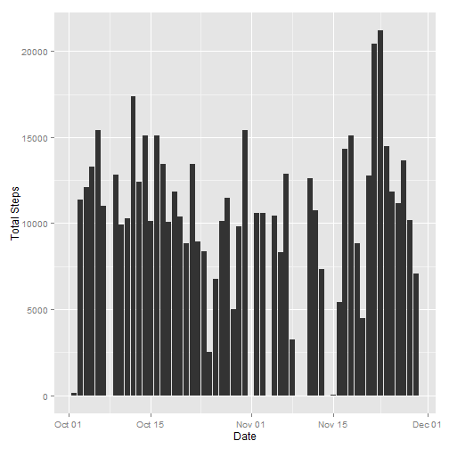
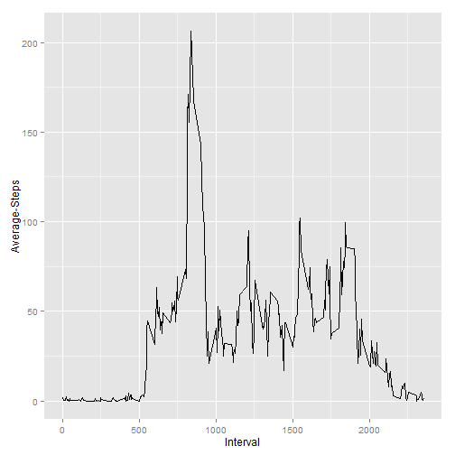

Peer Assignment 1
========================================================
Part1

First, I read the data into R

```r
data <- read.csv("activity.csv",
                 colClasses = c("interval"="numeric", "date" = "character"))
splitdata <- split(data, data$date)
sums <- na.omit(lapply(splitdata, function(x) sum(x[,1])))

sums <- data.frame(
        date = rep(names(sums), lapply(sums, length)),
        totalsteps = unlist(sums))
```


Then I loaded ggplot2 and used it to create a histogram showing the total number of steps taken each day

*The NA values are removed


```r
library(ggplot2)
qplot(as.Date(date), totalsteps, data = sums, stat="identity",
           geom = "bar", xlab = "Date", ylab = "Total Steps")
```

```
## Warning: Removed 8 rows containing missing values (position_stack).
```

 

I found the the mean and median of these values

```r
mn1 <- mean(sums$totalsteps, na.rm = T)
md1 <- median(sums$totalsteps, na.rm = T)
print(mn1)
```

```
## [1] 10766
```

```r
print(md1)
```

```
## [1] 10765
```
Part2

A graph showing the average number of steps at each interval

```r
intsplit <- split(data, data$interval)
means <- na.omit(lapply(intsplit, function(x) mean(x[,1], na.rm = T)))
means <- data.frame(stringsAsFactors = F, interval = rep(names(means), lapply(means, length)), avesteps = unlist(means))
means$interval <- as.numeric(means$interval)
ggplot(data = means, aes(x = interval, y = avesteps)) + geom_line() + xlab("Interval") + ylab("Average-Steps")
```

 

The maximun average number of steps occures in interval 835

```r
maxsteps <- max(means$avesteps, na.rm = T)
maxinterval <- subset(means, avesteps==maxsteps)
maxinterval
```

```
##     interval avesteps
## 835      835    206.2
```
Part3

This shows the total number of missing values

```r
nas <- data[!complete.cases(data), ]
nrow(nas)
```

```
## [1] 2304
```
I replaced all missing values with the average number of steps taken in an interval


```r
sums[is.na(sums)] = mean(data[,1], na.rm =T)

qplot(as.Date(date), totalsteps, stat="identity", data = sums,
      geom = "bar", xlab = "Date", ylab = "Total Steps")
```

 

These numbers show the new mean and median of the data set with NA's replaced

```r
mn2 <- mean(sums$totalsteps, na.rm = T)
md2 <- median(sums$totalsteps, na.rm = T)
print(mn2)
```

```
## [1] 9359
```

```r
print(md2)
```

```
## [1] 10395
```
By replacing these missing values instead of simply excluding them the mean of total daily steps decreased by 1407 and the median of total daily steps decreased by 370.

```r
mn1 - mn2
```

```
## [1] 1407
```

```r
md1 - md2
```

```
## [1] 370
```
Part4

Well, looks like I'm not going to finish this one. Close though...
